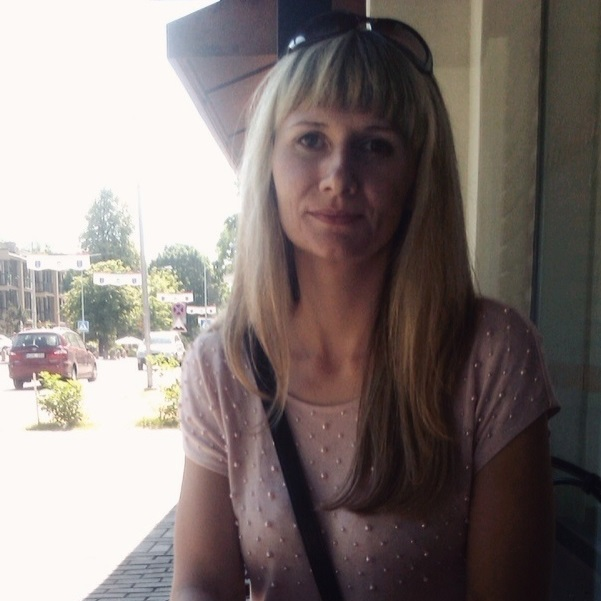

# Maryna Sudnik
*tel.:* **506827611**\
*git hub:* [Marina-SB](https://github.com/Marina-SB/)\
*discord* **Maryna#8160**\
\
## SKILLS
* HTML5‚ CSS3, website layout
* block, cross-browser, adaptive layout for mobile devices, code semantics, validity, CSS preprocessor SCSS. Optimization of graphics and download speed
* working with graphic editors Figma, Photoshop at the level of layout cutting
* basic knowledge of Javascript, jQuery, PHP
* website development on CMS (WordPress)
## WORK EXPERIENCE
### Layout of a multi-page website on WordPress
Created a multi-page site. Feedback form included. Made adaptation of the project for mobile devices.\
*Completion time:* **14 days**\
*Number of pages:* **5**\
[belkonstrukciya](https://belkonstrukciya.by/)
### Layout of a multi-page website on WordPress
Created a multi-page site. Feedback form included. Made adaptation of the project for mobile devices.\
*Completion time:* **30 days**\
*Number of pages:* **43**\
[Yasli-sad 3 Grodno](https://ys3grodno.by/)
## LANGUAGES
Russian - native\
Polish - A2\
English - A1